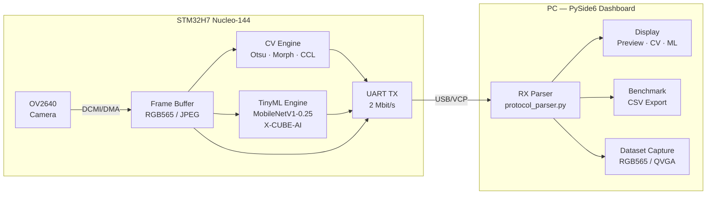
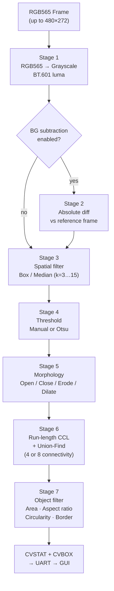
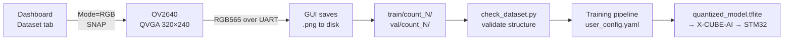
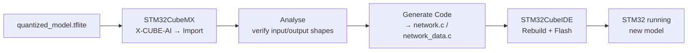

# STM32 Edge Vision — Reference Dashboard & TinyML Counting Model

A complete embedded-vision demonstrator for **STM32H7 + OV2640**:

- Real-time camera capture via DCMI/DMA
- Classical Vision (CV) object detection — Otsu/manual threshold, morphology, bounding-box extraction — **runs on-chip**
- TinyML object counting (MobileNetV1-0.25, 5 classes) via X-CUBE-AI — **runs on-chip**
- PySide6 Reference Dashboard on the PC for control, visualisation, benchmarking and dataset capture

> **All inference runs on the STM32.** The GUI only visualises results, saves frames, and manages the benchmark.

---

## Table of contents

1. [System architecture](#system-architecture)
2. [Repository structure](#repository-structure)
3. [Hardware setup](#hardware-setup)
4. [Quick start — GUI](#quick-start--gui)
5. [Quick start — ML training](#quick-start--ml-training)
6. [Model specification](#model-specification)
7. [Training results](#training-results)
8. [CV pipeline](#cv-pipeline)
9. [UART protocol](#uart-protocol)
10. [Dataset capture workflow](#dataset-capture-workflow)
11. [Training workflow](#training-workflow)
12. [STM32 deployment (X-CUBE-AI)](#stm32-deployment-x-cube-ai)
13. [Benchmarking](#benchmarking)
14. [Troubleshooting](#troubleshooting)
15. [Dependencies](#dependencies)

---

## System architecture



---

## Repository structure

```text
Machine-Vision-on-Microcontrollers/
│
├─ GUI_App/                              # PySide6 Reference Dashboard
│  └─ app/
│     ├─ src/
│     │  ├─ main.py                      # Qt application entry point
│     │  ├─ reference_window.py          # Main controller (6 mixins)
│     │  ├─ protocol_parser.py           # STM32 UART protocol parser
│     │  ├─ serial_service.py            # QSerialPort wrapper
│     │  ├─ image_utils.py               # JPEG / RGB565 / GRAY conversion
│     │  ├─ dashboard_controller.py      # Serial + camera mode (DashboardMixin)
│     │  ├─ rx_controller.py             # UART RX path, frame decode (RxMixin)
│     │  ├─ display_controller.py        # Preview refresh, CV/ML labels (DisplayMixin)
│     │  ├─ bench_controller.py          # Benchmark table, CSV export (BenchMixin)
│     │  ├─ save_controller.py           # Frame/log save (SaveMixin)
│     │  ├─ dataset_controller.py        # Automated dataset capture (DatasetMixin)
│     │  ├─ app_constants.py             # Constants, stylesheet
│     │  └─ app_helpers.py               # Path helpers, FrameTransfer, norm01
│     ├─ ui/
│     │  └─ reference_window.ui          # Qt Designer layout
│     └─ assets/
│        └─ app_icon.ico
│
├─ CubeIDE_Workspace/
│  └─ STM32_H7Firmware/                  # STM32CubeIDE project
│     ├─ Core/
│     │  ├─ Src/
│     │  │  ├─ main.c                    # Buffer alloc, MPU, task creation
│     │  │  ├─ camera_app.c/.h           # UART command handler, FreeRTOS tasks
│     │  │  ├─ camera_capture.c/.h       # DCMI/DMA frame capture
│     │  │  ├─ camera_proto.c/.h         # UART protocol formatters
│     │  │  ├─ camera_parse.c/.h         # Command parser
│     │  │  ├─ cv_engine.c/.h            # CV pipeline (7 stages)
│     │  │  ├─ tinyml_engine.c/.h        # X-CUBE-AI inference wrapper
│     │  │  ├─ tinyml_preprocess.c/.h    # RGB565 → uint8 96×96 tensor
│     │  │  ├─ uart_tx.c/.h              # Non-blocking DMA UART TX
│     │  │  └─ ov2640_Drive.c/.h         # OV2640 camera driver
│     │  └─ Inc/                         # Corresponding header files
│     └─ X-CUBE-AI/                      # Generated by STM32CubeMX
│        └─ App/
│           ├─ network.c/.h              # Generated AI network kernel
│           ├─ network_data.c/.h         # Model weights (Flash)
│           ├─ network_data_params.c/.h  # Weight parameters
│           ├─ network_config.h          # Network configuration
│           ├─ network_generate_report.txt # X-CUBE-AI analysis report
│           ├─ app_x-cube-ai.c/.h        # Integration layer
│           └─ constants_ai.h
│
├─ ML training/                          # PC-side TinyML workflow
│  ├─ dataset/                           # git-ignored — keep locally
│  │  ├─ train/ count_0…count_4/         # ≥ 50 images per class
│  │  └─ val/   count_0…count_4/         # ≥ 10 images per class
│  ├─ src/
│  │  ├─ train_count_model.py            # Standalone Keras training script
│  │  ├─ predict_count_tflite.py         # PC-side TFLite verification + hash check
│  │  └─ check_dataset.py                # Dataset structure validator
│  └─ Model/
│     ├─ quantized_model.tflite          # ← Deployable model (214 KiB)
│     ├─ image_classification/
│     │  └─ user_config.yaml             # ST Model Zoo training config
│     └─ 2026_05_03_09_11_10/            # Training run artefacts
│        ├─ Training_curves.png          # Loss / accuracy curves
│        ├─ logs/metrics/train_metrics.csv
│        └─ quantized_models/quantized_model.tflite
│
├─ requirements.txt                      # Unified Python dependencies
└─ README.md
```

---

## Hardware setup

| Part | Details |
|------|---------|
| MCU board | STM32H743ZI — Nucleo-144 |
| Camera | OV2640, connected via DCMI + DMA |
| UART | USART3 → ST-LINK VCP, **2 000 000 Baud, 8N1** |
| LED (heartbeat) | Red LED PB14 — 1 Hz blink = firmware running |
| Push button | PC13 — manual snapshot trigger |

**Memory layout**

| Region | Size | Content |
|--------|------|---------|
| RAM_D1 | 512 KB | Frame buffer (255 KB) + CV binary buffer (128 KB) |
| RAM_D2 | 288 KB | CV temp buffer (128 KB) + CV background buffer (128 KB) |
| RAM_D3 | 64 KB | TinyML activation buffer (40 KB) |
| Flash | ~285 KB | X-CUBE-AI runtime + network weights (214 KB) |

---

## Quick start — GUI

```bash
# 1. Create virtual environment
python -m venv .venv
.venv\Scripts\activate          # Windows
source .venv/bin/activate       # Linux / macOS

# 2. Install dependencies
pip install -r requirements.txt

# 3. Run the dashboard
python GUI_App/app/src/main.py
```

Connect to the correct COM port at **2 000 000 Baud**.  
The "STM32 ready" indicator appears after `OV2640 ready` is received.

**Basic workflow**

| Step | GUI action | UART command |
|------|-----------|--------------|
| 1 | Mode = RGB → **SNAP** | `MODE RGB` + `SNAP` |
| 2 | **Run STM32 CV** | `CV RUN` |
| 3 | **Run STM32 TinyML** | `TM RUN` |
| 4 | Set GT Count → **Add Run** | — |
| 5 | **Export CSV** | — |

> CV RUN and TM RUN always operate on the **last captured** RGB565 frame.

---

## Quick start — ML training

```bash
# 1. Validate dataset
python "ML training/src/check_dataset.py" --root "ML training/dataset"

# 2. Edit ML training/Model/image_classification/user_config.yaml
#    Set training_path, validation_path, quantization_path to absolute paths

# 3. Clone ST Model Zoo (once)
cd "ML training/Model"
git clone https://github.com/STMicroelectronics/stm32ai-modelzoo-services
pip install -e stm32ai-modelzoo-services

# 4. Train + quantise (chain_tqe)
cd stm32ai-modelzoo-services/image_classification/tf
python stm32ai_main.py \
    --config-path ../../../image_classification \
    --config-name user_config.yaml

# 5. Verify on PC
python "ML training/src/predict_count_tflite.py" \
    --model "ML training/Model/quantized_model.tflite" \
    --image path/to/frame.png \
    --show-hash
```

---

## Model specification

| Field | Value |
|-------|-------|
| Architecture | MobileNetV1 α=0.25, depthwise separable convolutions |
| Input shape | **96 × 96 × 3** (H × W × C) |
| Colour space | **RGB** (3 channels) |
| Input dtype | **uint8 \[0…255\]** |
| Quantisation | Post-training, `QLinear(scale=1/127.5, zero_point=127)` |
| Output | float32 \[5\], Softmax probabilities |
| Classes | `count_0`, `count_1`, `count_2`, `count_3`, `count_4` |
| Parameters | 211,621 |
| MACC (ops) | **7,550,858** |
| Weights — Flash | **219,844 B (214.7 KiB)** |
| Activations — RAM | **41,152 B (40.2 KiB)** |
| Total Flash (incl. runtime) | **285,351 B (~279 KB)** |
| Total RAM (incl. runtime) | **57,876 B (~57 KB)** |
| Resize method | **Nearest-neighbour, full-frame stretch** (no padding, no letterbox) |

### ⚠ Preprocessing contract — must match firmware

The STM32 firmware (`tinyml_preprocess.c`) maps each pixel with integer-floor nearest-neighbour:

```c
sx = ox * src_width  / 96;   // integer floor — no rounding
sy = oy * src_height / 96;
```

`user_config.yaml` **must** set:

```yaml
preprocessing:
  resizing:
    interpolation: nearest
    aspect_ratio: stretch     # NOT "fit" — adds letterboxing firmware never replicates
  color_mode: rgb             # NOT grayscale — model expects 3 channels
```

### ❌ Common misconfigurations

| Wrong value | Correct value | Impact |
|-------------|--------------|--------|
| `input_shape: (48, 48, 1)` | `(96, 96, 3)` | Wrong model size |
| `color_mode: grayscale` | `rgb` | 1-channel vs 3-channel mismatch |
| `aspect_ratio: fit` | `stretch` | Black-border domain shift |
| `board: STM32H747I-DISCO` | `NUCLEO-H7` | Wrong benchmarking target |

---

## Training results

**Run:** `2026_05_03_09_11_10` — ST Model Zoo `chain_tqe` (train → quantise → evaluate)

| Metric | Value |
|--------|-------|
| Best validation accuracy | **97.14 %** (epoch 35, 43, 44) |
| Best training accuracy | **99.93 %** (epoch 34) |
| Final validation accuracy | **94.29 %** (epoch 55) |
| Training epochs | 55 |
| LR schedule | 1e-3 → 5e-4 (ep 30) → 2.5e-4 (ep 44) → 1.25e-4 (ep 52) |
| Framework | TensorFlow 2 / Keras, ST Model Zoo |


> Training on real OV2640 frames captured with the Dataset Capture tool.  
> The preprocessing pipeline (nearest-floor resize, full-frame stretch, RGB) exactly mirrors the STM32 firmware.

**X-CUBE-AI analysis summary** (`network_generate_report.txt`)

| Layer type | Count | % of MACC |
|------------|-------|-----------|
| Conv2D (standard + depthwise) | 27 + 14 = 41 | 99.3 % |
| GlobalAvgPool + Dense + Softmax | 3 | 0.05 % |
| Input conversion (u8→s8) | 1 | 0.7 % |

---

## CV pipeline



**CV command reference**

| Command | Effect |
|---------|--------|
| `CV RUN` | Run full pipeline on last RGB565 frame |
| `CV GET` | Send current config (CVCFG) |
| `CV EN 0\|1` | Disable / enable CV engine |
| `CV PRESET 0..3` | CUSTOM / FAST / ROBUST / ACCURATE |
| `CV THRMODE 0\|1` | Manual / Otsu auto-threshold |
| `CV THR 0..255` | Manual threshold value |
| `CV INV 0\|1` | Invert binary image |
| `CV FILTER 0..2` | OFF / BOX / MEDIAN |
| `CV BLUR 0..7` | Pre-threshold blur kernel (0=off, 1→3×3 … 7→15×15) |
| `CV MORPHMODE 0..4` | OFF / OPEN / CLOSE / ERODE / DILATE |
| `CV MORPH 0..7` | Morphology kernel size |
| `CV CON 4\|8` | CCL connectivity |
| `CV MINAREA n` | Minimum object area (px²) |
| `CV MAXAREA n` | Maximum object area (0=unlimited) |
| `CV ASPECT min max` | Aspect ratio filter (×1000) |
| `CV CIRC min` | Circularity minimum (×1000, 1000=circle) |
| `CV BGCAP` | Capture current frame as background |
| `CV BGSUB 0\|1` | Enable background subtraction |
| `CV BORDFILT 0\|1` | Reject border-touching blobs |
| `CV ROI 1 x y w h` | Set region of interest |
| `CV ROI 0` | Disable ROI |

---

## UART protocol

**Connection:** USART3, **2 000 000 Baud, 8N1**, no flow control

### Frame transfer headers (raw bytes follow immediately after `\r\n`)

```
JPG: <bytes>
RGB565: <width> <height> <bytes>
GRAY: <width> <height> <bytes>
```

### Status / log lines

```
INFO:  <message>
WARN:  <message>
ERR:   <message>
DEBUG: <message>
STAT:  FPS=X.X SIZE=XB HEAP=XKB FB=XKB LAT=Xms
```

### Classical Vision (CV)

```
CVCFG: EN=1 PRESET=0 THR=128 THRMODE=0 INV=0
       BLUR=0 FILTER=0 MORPH=0 MORPHMODE=0 CON=8
       MIN=50 MAX=0 ARMIN=0 ARMAX=0 CIRCMIN=0
       BORDFILT=1 BGSUB=0 BGCAP=0
       ROIEN=0 ROIX=0 ROIY=0 ROIW=0 ROIH=0

CVSTAT: COUNT=N MEAN=X MAX=X MIN=X BRIGHT=X TIME=Xms
        REJSMALL=X REJLARGE=X REJBORDER=X REJSHAPE=X
        FGPIX=X RAWCOMP=X BOXES=N
CVBOX:  ID=N AREA=X X=X Y=X W=X H=X PERI=X CIRC=X
CVDONE
```

### TinyML

```
TMCFG:  EN=1 INPUT=96x96x3 CLASSES=5 MODEL=quantized_model
TMINFO: STATUS=XCUBEAI_OK RAM=40KB FLASH=215KB
TMRES:  CLASS=count_N IDX=N CONF=XXX TIME=Xms UNCERTAIN=0
TMPROB: IDX=N NAME=COUNT_N SCORE=XXX
TMDONE
```

> `CONF` and `SCORE` are in **permille (0…1000)**. The GUI normalises to 0.0–1.0.  
> When `UNCERTAIN=1`, `CLASS=UNCERTAIN` — the GUI marks it as uncertain, not a real class.

**TinyML commands**

| Command | Effect |
|---------|--------|
| `TM RUN` | Run inference on last RGB565 frame |
| `TM GET` | Request TMCFG + TMINFO |
| `TM EN 0\|1` | Enable / disable TinyML |

---

## Dataset capture workflow



1. Connect STM32 → GUI → Dataset tab.
2. Select **split** (`train` / `val`) and **label** (`count_0`…`count_4`).
3. Click **Capture N frames** — the GUI automatically snaps and saves.
4. Collect **≥ 50 training** and **≥ 10 validation** images per class.
5. All PNGs are 320×240 RGB — identical to firmware inference input.

---

## Training workflow

### 1. Validate dataset

```bash
python "ML training/src/check_dataset.py" --root "ML training/dataset"
```

### 2. Configure `user_config.yaml`

```yaml
dataset:
  training_path:     "/abs/path/to/dataset/train"
  validation_path:   "/abs/path/to/dataset/val"
  quantization_path: "/abs/path/to/dataset/train"

preprocessing:
  resizing:
    interpolation: nearest
    aspect_ratio: stretch    # ← critical
  color_mode: rgb            # ← critical

model:
  name: mobilenet
  alpha: 0.25

training:
  epochs: 60
  batch_size: 32
```

### 3. Train (ST Model Zoo)

```bash
cd "ML training/Model/stm32ai-modelzoo-services/image_classification/tf"
python stm32ai_main.py \
    --config-path ../../../image_classification \
    --config-name user_config.yaml
```

Output: `experiments_outputs/<timestamp>/quantized_models/quantized_model.tflite`

### 4. Verify preprocessing parity on PC

```bash
python "ML training/src/predict_count_tflite.py" \
    --model "ML training/Model/quantized_model.tflite" \
    --image path/to/frame.png --show-hash
```

Compare `hash=XXXXXXXX` with STM32 log `TM_IN: hash=...` — **identical hash = identical pipeline**.

---

## STM32 deployment (X-CUBE-AI)



1. Open **STM32CubeMX** → X-CUBE-AI → Import `quantized_model.tflite`.
2. Click **Analyse** — verify:
   - Input: `uint8(1×96×96×3)` — `QLinear(0.00784, 127)`
   - Output: `float32(1×5)`
   - Activations: **40.2 KiB**, Weights: **214.7 KiB**
3. **Generate Code** → rebuild in STM32CubeIDE.
4. `tinyml_engine.c` requires **no changes** after regeneration.

### X-CUBE-AI v10.2 — two mandatory lines in `tinyml_init()`

```c
// 1. Initialise STAI runtime before any network call.
//    Without this, ai_network_run() always produces constant outputs.
stai_runtime_init();

// 2. Pass NULL for weights — ai_network_data_params_get() sets the
//    correct Flash pointer internally. Passing the weights table directly
//    overrides it with the wrong address.
ai_network_create_and_init(&g_network, activations, NULL);
```

---

## Benchmarking

For a **reproducible CV vs TinyML comparison**:

1. `SNAP` — capture one RGB565/QVGA frame.
2. `CV THRMODE 1` + `CV RUN` — Otsu auto-threshold (no manual tuning).
3. `TM RUN` — inference on the **same frame** (no new SNAP).
4. Set **GT Count** in the GUI → **Add Current Run**.
5. Repeat for scenes with 0, 1, 2, 3, 4 objects.
6. **Export CSV** → analyse accuracy, timing, uncertain predictions.

**Expected performance on STM32H743 @ 480 MHz**

| Operation | Typical latency |
|-----------|----------------|
| SNAP (QVGA RGB565) | ~150–250 ms |
| CV RUN (ROBUST preset, QVGA) | ~15–40 ms |
| TM RUN (QVGA → 96×96 preprocess + inference) | ~120–200 ms |

---

## Troubleshooting

| Symptom | Cause | Fix |
|---------|-------|-----|
| `TM_RAW_OUT` always `[0.5, 0.5, 0, 0, 0]` | `stai_runtime_init()` not called | Add before `ai_network_create_and_init()` |
| Constant output for all inputs | `weights=g_network_weights_table` | Pass `NULL` as weights argument |
| PC hash ≠ STM32 hash | Preprocessing mismatch | Check `aspect_ratio: stretch`, `color_mode: rgb`, `TINYML_PREPROCESS_BYTESWAP=0` |
| All predictions = count_0 | Domain shift (wrong train data) | Retrain with real OV2640 frames via Dataset Capture |
| `UNCERTAIN` on all frames | Confidence below threshold | Lower `TINYML_UNCERTAIN_THRESHOLD_PERMILLE` or retrain |
| Red LED not blinking | Firmware not running | Check build, power, ST-LINK |
| GUI shows no frames | Wrong port or baud | Verify 2 000 000 Baud, firmware flashed |
| CV returns 0 objects | Wrong threshold or too small area | Use Otsu mode; lower `CV MINAREA` |
| `CV RUN` error: "needs RGB565 frame" | JPEG mode active | Switch to RGB mode, press SNAP first |
| Build error: missing `stai.h` | X-CUBE-AI not generated | Re-run CubeMX code generation |

---

## Dependencies

```
PySide6>=6.6.0          GUI + serial port
pyserial>=3.5
Pillow>=10.3.0
tensorflow==2.16.2      training + TFLite quantisation
numpy>=1.24.0,<2.0
pandas>=2.0.0
mlflow>=2.11.0
matplotlib>=3.8.0
pyyaml>=6.0
omegaconf>=2.3.0
tqdm>=4.66.0
```

```bash
pip install -r requirements.txt
```

---

## Contributors

| Name | Role |
|------|------|
| Mutasem Bader | STM32 firmware (FreeRTOS, DCMI/DMA, CV engine, TinyML, UART protocol), Python GUI dashboard, ML training pipeline, system integration |

---

## License

Copyright (c) 2026 Mutasem Bader — All Rights Reserved.  
Viewing is permitted. Copying, modifying, or submitting as own work is strictly prohibited.  
See [LICENSE](LICENSE) for details.
